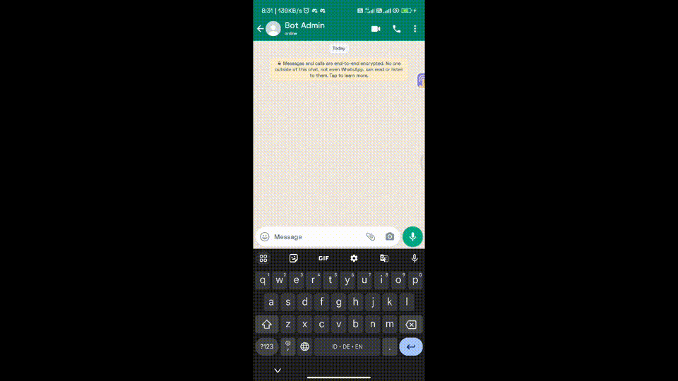

# simple-wa-bot



## Description
Ruuning simple WhatsApp bot thru' Node.js

## Features
- Saying hello
- Getting the time response
- Echo features
    - The chatbot will respond the same message sent

## Installation
Prepare terminal (MacOS/Linux) or Command Prompt (Windows) ammunition and type
```bash
git clone https://github.com/daimessdn/simple-wa-bot.git
cd simple-wa-bot
npm install
```

## Instruction
1. Prepare project installation (refer to [Installation](#installation) above)
2. Run project by typing `npm run dev` (alternatively: `nodemon index.js`)
3. Using your WhatsApp, link your device by scanning QR code generated once the project run.
4. Wait until the client ready.
5. Now you can try the simple chatbot